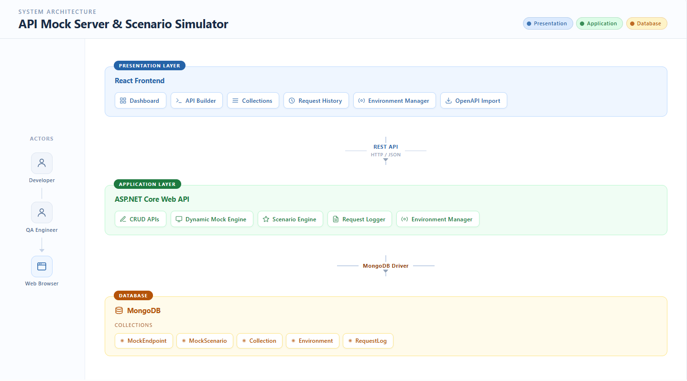
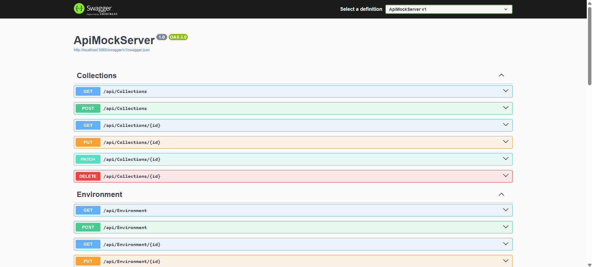
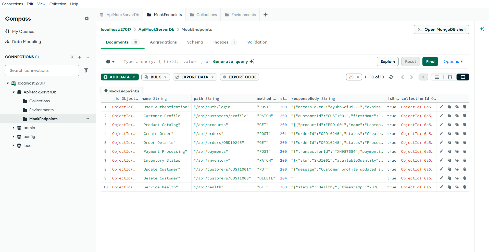

# API Mock Server & Scenario Simulator — Backend

A scalable ASP.NET Core Web API for creating, managing, and serving configurable mock REST APIs.

The backend acts as the core engine of the API Mock Server & Scenario Simulator, providing REST APIs for managing mock endpoints, collections, and environments while persisting data in MongoDB. It is designed to evolve into a configurable mock server capable of simulating real-world backend behaviors for frontend development and quality assurance.

---

# Overview

The **API Mock Server & Scenario Simulator** is a full-stack developer tool that enables frontend developers and QA engineers to continue application development without depending on backend service availability.

This repository contains the backend application built using **ASP.NET Core Web API** and **MongoDB**. It exposes REST APIs for configuring mock endpoints and serves as the foundation for future capabilities such as dynamic mock execution, scenario simulation, request logging, and OpenAPI import.

---

# Features

## Currently Available

### Mock Endpoint Management

- Create mock endpoints
- Update endpoint configurations
- Delete endpoints
- Retrieve endpoint definitions

### Collections Management

- Create collections
- Update collections
- Delete collections
- Organize mock endpoints

### Environment Management

- Create environments
- Update environments
- Delete environments
- Activate environments

### Backend Infrastructure

- RESTful API architecture
- MongoDB integration
- Swagger / OpenAPI documentation
- Request validation
- Layered project structure
- JSON-based API responses

---

## Planned Features

The backend architecture is designed to support future enhancements including:

- Dynamic Mock Engine
- Scenario Engine
- Dynamic Request Routing
- Delay Simulation
- Timeout Simulation
- Random Failure Simulation
- Custom HTTP Status Codes
- Request Logging
- Response Templating
- OpenAPI Import
- Rate Limiting Simulation
- Malformed JSON Responses

---

# Technology Stack

## Backend

- ASP.NET Core Web API (.NET 8)
- MongoDB
- Swagger / OpenAPI

## Development Tools

- Visual Studio Code
- Git
- GitHub

---

# System Architecture

The backend forms the application layer of the API Mock Server & Scenario Simulator and communicates with the React frontend through REST APIs while persisting data in MongoDB.



Additional backend architecture documentation is available in the `docs` directory.

---

# Project Structure

```text
ApiMockServer
│
├── Controllers
│
├── Models
│
├── DTOs
│
├── Services
│
├── Repositories
│
├── Data
│
├── Configuration
│
├── Properties
│
├── appsettings.json
├── Program.cs
└── README.md
```

---

# Getting Started

## Clone Repository

```bash
git clone <backend-repository-url>
```

---

## Restore Packages

```bash
dotnet restore
```

---

## Configure MongoDB

Update the MongoDB connection string inside:

```text
appsettings.json
```

Example:

```json
"MongoDbSettings": {
  "ConnectionString": "<your-mongodb-connection-string>",
  "DatabaseName": "<your-database-name>"
}
```

---

## Run the Application

```bash
dotnet run
```

Backend URL

```
http://localhost:5065
```

Swagger Documentation

```
http://localhost:5065/swagger
```

---

# REST APIs

## Mock Endpoints

| Method | Endpoint |
|---------|----------|
| GET | `/api/MockEndpoint` |
| POST | `/api/MockEndpoint` |
| PUT | `/api/MockEndpoint/{id}` |
| DELETE | `/api/MockEndpoint/{id}` |

---

## Collections

| Method | Endpoint |
|---------|----------|
| GET | `/api/Collection` |
| POST | `/api/Collection` |
| PUT | `/api/Collection/{id}` |
| DELETE | `/api/Collection/{id}` |

---

## Environments

| Method | Endpoint |
|---------|----------|
| GET | `/api/Environment` |
| POST | `/api/Environment` |
| PUT | `/api/Environment/{id}` |
| DELETE | `/api/Environment/{id}` |

---

# Database

The backend currently uses MongoDB with the following collections:

- MockEndpoint
- Collection
- Environment

The architecture is prepared to support additional collections such as:

- MockScenario
- RequestLog

---

# Screenshots

## Swagger Documentation



Interactive API documentation generated using Swagger.

---

## MongoDB Collections



MongoDB collections used by the backend application.

---

# Documentation

The following documentation is included with this repository.

| Document | Description |
|----------|-------------|
| `docs/system-architecture.png` | High-level architecture of the API Mock Server & Scenario Simulator |
| `docs/backend-component-architecture.png` | Backend application structure and logical components |

---

# Roadmap

The backend will continue to evolve with additional capabilities.

- [ ] Dynamic Mock Engine
- [ ] Scenario Engine
- [ ] Dynamic Request Routing
- [ ] Request Logging
- [ ] OpenAPI Import
- [ ] Response Templating
- [ ] Rate Limiting Simulation
- [ ] Malformed JSON Responses
- [ ] Performance Improvements

---

# Contributing

Contributions are welcome.

Please create a feature branch, follow the existing project structure, and ensure all APIs are tested before submitting a pull request.

---

# Author

**Sasi Kaladhar**

Developer

API Mock Server & Scenario Simulator

---

# License

This project is intended for educational and internship purposes.
